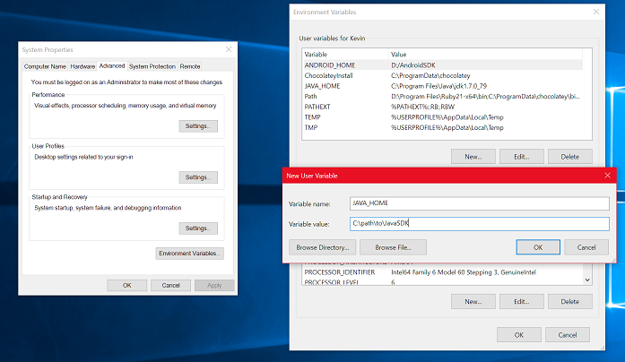
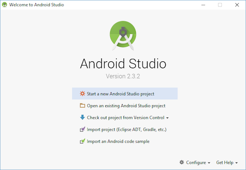
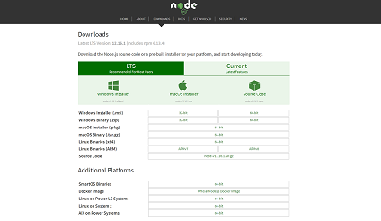

# Guide for setting up React-Native/Cordova

# 1. Setting up

## Android

### 1.1 Download JAVA SE Development Kit (JDK) Kit 8

Please download and install JDK 8 from `https://www.oracle.com/java/technologies/javase-jdk8-downloads.html`

Once installed, you required to set the JAVA_HOME environment path.  

For windows:

1. Open the System pane under System and Security in the Windows Control Panel, then click on Change settings.... Open the Advanced tab and click on Environment Variables....
2. Click on New... to create a new `JAVA_HOME` and its path `C:\Program Files\Java\jdk1.8.0_211`. Please use the path where you saved your JDKs.

### 1.2 Download Android Studio

Please download and install android studio from `https://developer.android.com/studio`

#### 1.2.1 Installing of Android SDK

After installing of android studio, ensure at least Android 9 (Pie) SDK is installed.  
The SDK Manager can be accessed from the "Welcome to Android Studio" screen. Click on "Configure", then select "SDK Manager".

The SDK Manager can also be found within the Android Studio "Preferences" dialog, under Appearance & Behavior → System Settings → Android SDK.

#### 1.2.2 Configure the ANDROID_HOME environment variable

For windows:

1. Open the System pane under System and Security in the Windows Control Panel, then click on Change settings.... Open the Advanced tab and click on Environment Variables....
2. Click on New... to create a new ANDROID_HOME user variable that points to the path to your Android SDK:

The SDK is installed, by default, at the following location: `c:\Users\YOUR_USERNAME\AppData\Local\Android\Sdk`

#### 1.2.3 Add platform-tools to Path

For windows:

1. Open the System pane under System and Security in the Windows Control Panel, then click on Change settings.... Open the Advanced tab and click on Environment Variables.... Select the Path variable, then click Edit.
2. Click New and add the path to platform-tools to the list.

The default location for this folder is: `c:\Users\YOUR_USERNAME\AppData\Local\Android\Sdk\platform-tools`

### 1.3 Installing NodeJS

Please download and install NodeJs from `https://nodejs.org/en/download/`.  
This is used to develop our javascript project.

Run the installer

### 1.4 Installing git client

Please download and install git client from `https://git-scm.com/downloads`.  
The git client is version control and code repository tool.

# 2. Running development

## 2.1 Resolving issues with NDK

If you are running the react-native for the first time, you may be this NDK version 20.0.5594570 not found error when you run `npm run android`.

This is can be resolved by downloading the NDK version 20.0.5594570. To do that go to `Android Studio` -> `SDK manager` -> `SDK tools` and tick the `Show Package Details` checkbox. After that select the NDK version 20.0.5594570 to download.
